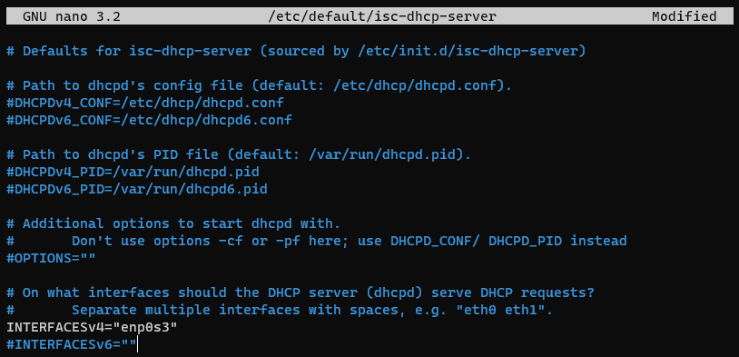

# Configurer un serveur DHCP sur Debian 10 (Buster)

## Sommaire
  - [Kézako ?](#kézako-)
  - [Prérequis](#prérequis)
  - [Installation d'ISC DHCP Server:](#installation-disc-dhcp-server)
  - [Indiquer l'interface réseau à utiliser](#indiquer-linterface-réseau-à-utiliser)
  - [Spécifier les options du DHCP](#spécifier-les-options-du-dhcp)
    - [Définir le DNS distribué par le DHCP](#définir-le-dns-distribué-par-le-dhcp)
    - [Définir l'IP réseau et le masque de sous-réseau](#définir-lip-réseau-et-le-masque-de-sous-réseau)
    - [Définir la plage d'IP à distribuer](#définir-la-plage-dip-à-distribuer)
    - [Définir la passerelle](#définir-la-passerelle)
  - [Verdict...](#verdict)
  - [Ça ne marche pas ?](#ça-ne-marche-pas-)
    - [Regarder dans les logs](#regarder-dans-les-logs)
    - [Erreurs répétées](#erreurs-répétées)

## Kézako ?

Un serveur DHCP (Dynamic Host Configuration Protocol) a pour but de délivrer automatiquement une configuration IP valide aux divers équipements qui se connectent sur un réseau.

Pour rappel, un serveur DHCP doit déliver impérativement ces 3 choses au client: 
- Une adresse IP
- Un temps de bail, c'est à dire une durée de validité de l'adresse IP donnée
- Un masque de sous réseau, sans quoi l'adresse IP est inexploitable   

Optionnellement, il peut distribuer l'adresse d'un serveur DNS, mais aussi une passerelle. Notre DHCP distribuera ces 5 choses.

## Prérequis

- Installation Debian fonctionnelle
- Configuration et/ou interface réseau fonctionnelle avec un accès à Internet
- Accès Root 
Pour l'avoir, taper simplement: `su` (super user) suivi du mot de passe du compte root.

> Avant d'éditer chaque fichier, nous en ferons une sauvegarde afin de pouvoir retrouver un fichier exploitable en cas de pepin.  
> Nous ferons simplement une copie du fichier en rajoutant un `.old` à la fin du nom de ce dernier

## Installation d'ISC DHCP Server:
Mettre à jour la liste des paquets et installer `isc-dhcp-server`

    apt update  
    apt install isc-dhcp-server

Un message d'erreur provenant du serveur DHCP s'affichera juste à la fin de l'installation. 
Le serveur a en effet essayé de démarrer mais n'a pas réussi, ce qui est tout à fait normal puisqu'il n'est pas encore été configuré.

## Indiquer l'interface réseau à utiliser

Backup:  
``cp /etc/default/isc-dhcp-server /etc/default/isc-dhcp-server.old``

Éditer le fichier:  
``nano /etc/default/isc-dhcp-server``

Spécifier vers le bas de celui-ci l'interface réseau entre les guillemets de la ligne ``INTERFACESv4=""``  
Commenter la ligne ``INTERFACESv6`` puisque nous n'utiliserons pas d'IPv6.  
Exemple avec enp0s3:

Quitter avec `CTRL+X`, puis confirmer pour écraser le fichier.

## Spécifier les options du DHCP
Backup:  
``cp /etc/dhcp/dhcpd.conf /etc/dhcp/dhcpd.conf.old``

Éditer le fichier:  
``nano /etc/dhcp/dhcpd.conf``

Nous allons seulement changer les options qui seront vraiment nécessaires pour que le DHCP puissse tourner:

### Définir le DNS distribué par le DHCP
Vers le haut du fichier ``dhcpd.conf``, il sera possible de définir un nom de domaine (``domaine-name``) ainsi qu'un ou plusieurs DNS (``domaine-name-servers``).
Nous mettrons un domaine en ``quelquechose.local`` et un DNS comme ``1.1.1.1``, celui de CloudFlare.   
Les DNS doivent être séparés par une virgule si l'on souhaite en mettre plusieurs:

Il est possible de modifier les temps de bail (``default-lease-time`` et ``max-lease-time``). Ces temps sont donnés en secondes.

### Définir l'IP réseau et le masque de sous-réseau
Nous allons décommenter (retirer les #) autour de la ligne 30 de sorte à avoir ceci:

Nous pouvons ensuite sur cette ligne (la seule en blanche sur l'image) changer l'adresse IP et le masque pour correspondre à notre réseau.

### Définir la plage d'IP à distribuer
Nous allons ajouter cette option sur une nouvelle ligne entre les crochets. Elle se présente ainsi:  
``range adresse_IP_début adresse_IP_fin;``  

En sachant que les adresses IP début et fin sont distribuées.

Ne pas oublier le point virgule ( ; ) en fin de ligne !

Le résultat devrait ressembler à ceci:

### Définir la passerelle

Comme pour la plage d'IP nous allons ajouter une option:  
``option routers IP_passerelle;``

Enfin, écraser le fichier, et confirmer.

## Démarrage et test

Redémarrer le serveur avec:  
``systemctl restart isc-dhcp-server``

Regarder si le serveur est fonctionnel avec:  
``systemctl status isc-dhcp-server``

On voit ici que le serveur est en train de tourner et qu'il ne met pas d'erreurs.

## Ça ne marche pas ?

### Regarder dans les logs 
Afficher les logs à partir du bas pour voir ce qui ne va pas:
``tail -n 25 /var/log/syslog``

> Il s'agira très souvent d'un `;` manquant, d'une petite faute de frappe dans le fichier de configuration ou d'une interface mal déclarée

``tail`` Affiche à partir du bas du fichier (le fichier log peut-être TRÈS LONG).  
``-n`` Spécifie le nombre de lignes à récupérer

### Erreurs répétées

Supprimer le fichier dhcpd.pid:  
``rm /var/run/dhcpd.pid``

Puis tenter de redémarrer le serveur:  
``systemctl restart isc-dhcp-server``
