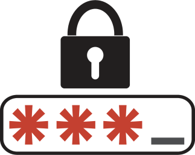

# Mots de passe et identifiants

Fichier rassemblant l'ensemble des mots de passes pour les routeurs, switches et serveurs de l'infrastructure

Le nom entre parethèses correspond au hostname du serveur ou de l'équipement.

- [Mots de passe et identifiants](#mots-de-passe-et-identifiants)
  - [Serveurs](#serveurs)
    - [Serveur Rennes (`rennes-svr`)](#serveur-rennes-rennes-svr)
    - [Serveur DMZ (`SERVEUR-DMZ`)](#serveur-dmz-serveur-dmz)
    - [Ferme Proxmox](#ferme-proxmox)
  - [Switches et routeurs](#switches-et-routeurs)

## Serveurs

### Serveur Rennes (`rennes-svr`)

| User | Password |
|---|---|
|root|root|
|admin-rennes|admin|

### Serveur DMZ (`SERVEUR-DMZ`)

| User | Password |
|---|---|
|root|root|
|admin-dmz|admin|

### Ferme Proxmox

| User | Password |
|---|---|
|root|admin|

## Switches et routeurs
|Connexion|Mot de passe|
|---|---|
|Telnet | admin|
|Local Privilégié| cisco |