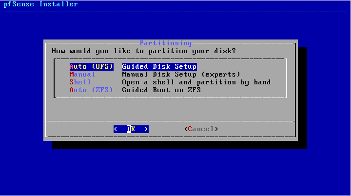
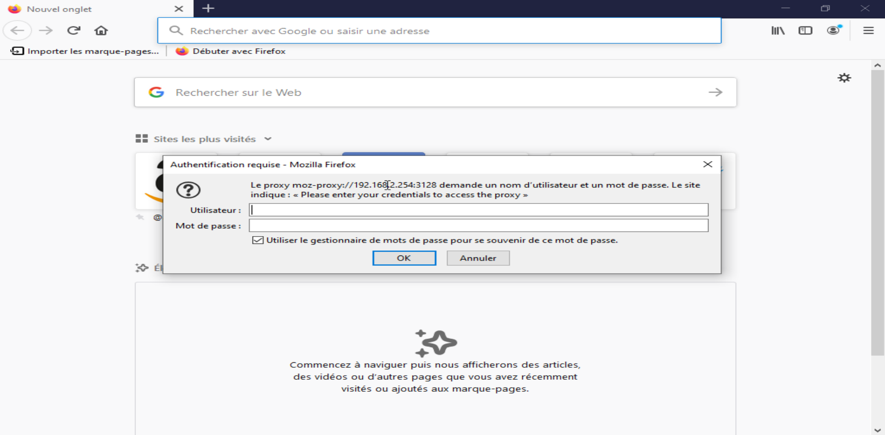
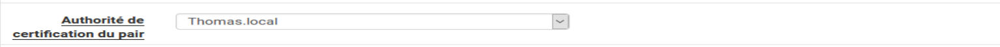
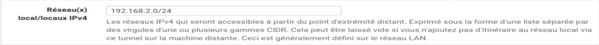

# Implémentation d’une infrastructure réseau

- [Implémentation d’une infrastructure réseau](#implémentation-dune-infrastructure-réseau)
  - [Schéma, plan et adressage IP de l’infrastructure](#schéma-plan-et-adressage-ip-de-linfrastructure)
  - [Solutions choisies](#solutions-choisies)
- [Mots de passe et identifiants](#mots-de-passe-et-identifiants)
    - [Serveur Rennes (`rennes-svr`)](#serveur-rennes-rennes-svr)
    - [Serveur DMZ (`SERVEUR-DMZ`)](#serveur-dmz-serveur-dmz)
    - [Ferme Proxmox](#ferme-proxmox)
    - [FTP](#ftp)
    - [DHCP](#dhcp)
    - [Active Directory](#active-directory)
    - [PHP My Admin](#php-my-admin)
    - [Serveur Mail](#serveur-mail)
  - [Switches et routeurs](#switches-et-routeurs)
- [Mise en place du conteneur HTTP + FTP](#mise-en-place-du-conteneur-http--ftp)
  - [Prérequis](#prérequis)
  - [Installation de Docker sur Debian 10](#installation-de-docker-sur-debian-10)
    - [Mise à jour et installation de paquets de base pour Docker](#mise-à-jour-et-installation-de-paquets-de-base-pour-docker)
    - [Ajout du dépôt Docker](#ajout-du-dépôt-docker)
  - [Création du conteneur](#création-du-conteneur)
  - [Installation de vsftpd dans le conteneur](#installation-de-vsftpd-dans-le-conteneur)
    - [Installation des paquets de base du conteneur](#installation-des-paquets-de-base-du-conteneur)
    - [Configuration](#configuration)
      - [Création d'un utilisateur `ftp` sans droits](#création-dun-utilisateur-ftp-sans-droits)
      - [Vous n'avez pas le droit Monsieur !](#vous-navez-pas-le-droit-monsieur-)
      - [Appliquer les modifications](#appliquer-les-modifications)
  - [Préparation de Nginx dans le conteneur](#préparation-de-nginx-dans-le-conteneur)
- [Configurer un serveur DHCP sur Debian 10](#configurer-un-serveur-dhcp-sur-debian-10)
  - [Kézako ?](#kézako-)
  - [Prérequis](#prérequis-1)
  - [Installation d'ISC DHCP Server:](#installation-disc-dhcp-server)
  - [Indiquer l'interface réseau à utiliser](#indiquer-linterface-réseau-à-utiliser)
  - [Spécifier les options du DHCP](#spécifier-les-options-du-dhcp)
    - [Définir le DNS distribué par le DHCP](#définir-le-dns-distribué-par-le-dhcp)
    - [Définir l'IP réseau et le masque de sous-réseau](#définir-lip-réseau-et-le-masque-de-sous-réseau)
    - [Définir la plage d'IP à distribuer](#définir-la-plage-dip-à-distribuer)
    - [Définir la passerelle](#définir-la-passerelle)
  - [Démarrage et test](#démarrage-et-test)
  - [Ça ne marche pas ?](#ça-ne-marche-pas-)
    - [Regarder dans les logs](#regarder-dans-les-logs)
    - [Erreurs répétées](#erreurs-répétées)
- [Configuration de l'infrastructure](#configuration-de-linfrastructure)
  - [Résumé de la configuration des Switchs](#résumé-de-la-configuration-des-switchs)
  - [Résumé de la configuration des Routeurs](#résumé-de-la-configuration-des-routeurs)
  - [Commandes communes à tous les équipements](#commandes-communes-à-tous-les-équipements)
    - [Hostname](#hostname)
    - [Sécuriser l'accès privilégié](#sécuriser-laccès-privilégié)
    - [Configuration Telnet](#configuration-telnet)
  - [Commandes et procédures des switchs en détail](#commandes-et-procédures-des-switchs-en-détail)
  - [Commandes et procédures des routeurs en détail](#commandes-et-procédures-des-routeurs-en-détail)
    - [Configurer les interfaces](#configurer-les-interfaces)
    - [Configurer RIPv2 (routage dynamique)](#configurer-ripv2-routage-dynamique)
      - [Étapes dans l'ordre](#étapes-dans-lordre)
      - [Exemple en déclarant trois réseaux](#exemple-en-déclarant-trois-réseaux)
    - [Configurer le protocole HSRP](#configurer-le-protocole-hsrp)
      - [Étapes dans l'ordre](#étapes-dans-lordre-1)
      - [Exemple](#exemple)
- [Proxmox](#proxmox)
- [Active Directory](#active-directory-1)
  - [Prérequis](#prérequis-2)
    - [Changement de Hostname](#changement-de-hostname)
    - [Changement d'IP](#changement-dip)
  - [Gestionnaire de serveur](#gestionnaire-de-serveur)
  - [Configuration du contrôleur de domaine](#configuration-du-contrôleur-de-domaine)
  - [Connexion](#connexion)
- [Serveur Mail](#serveur-mail-1)
  - [Installation des paquets et préparation du système](#installation-des-paquets-et-préparation-du-système)
  - [Installation et configuration de postfixadmin](#installation-et-configuration-de-postfixadmin)
  - [Configuration de Postfix](#configuration-de-postfix)
  - [Configuration de dovecot](#configuration-de-dovecot)
  - [Mise en place de la liaison Postfix <-> Dovecot](#mise-en-place-de-la-liaison-postfix---dovecot)
  - [Installation et configuration de Rainloop](#installation-et-configuration-de-rainloop)
- [PfSense](#pfsense)
  - [Installation de PfSense](#installation-de-pfsense)
  - [Configuration de PfSense](#configuration-de-pfsense)
  - [Configuration du VPN :](#configuration-du-vpn-)
  - [Configuration du client :](#configuration-du-client-)
- [Fichiers de configuration](#fichiers-de-configuration)
  - [Routeurs](#routeurs)
  - [Switches](#switches)
  - [Docker](#docker)
    - [/etc/nginx/nginx.conf](#etcnginxnginxconf)
    - [/etc/nginx/conf.d/default.conf](#etcnginxconfddefaultconf)
    - [/etc/vsftpd.conf](#etcvsftpdconf)

## Schéma, plan et adressage IP de l’infrastructure

Nous avons choisi d'utiliser le nom de domaine `ggp.local`


Connectivité entre les différents matériels:

- RG1 à RW1 PORT SERIAL 1 ↔ PORT SERIAL 0
- RG2 à RW1 PORT SERIAL 0 ↔ PORT SERIAL 1
- RW1 à RW2 PORT FA 0/0 ↔ PORT GI 0/1
- RW2 à RR1 PORT GI 0/0 ↔ PORT FA 0/1
- RR1 à SR1 PORT FA0/0 ↔ FA 0/1-24
- RG1 à SG1 PORT FA 0/0 ↔ FA0/1-24 

## Solutions choisies

Nos solutions tournent sur un mix de machines virtuelles, de conteneurs et de bare-metal.

Nos machines virtuelles tournent sur une ferme Proxmox tandis que nos conteneurs tournent à l'aide de Docker.

Nous avons choisi d'utiliser Debian la majorité du temps car considéré comme "standard". 

|Service|Serveur|Solution|Environnement d'exécution|OS / Image|IP/masque
|---|---|---|---|---|---|
|Active Directory + DNS||Windows Server 2019|Proxmox 6.4 (VM)|Windows Server 2019|172.16.200.3/24|
|Mail|||Proxmox 6.4 (VM)|Debian 10|172.16.200.4/24|
|DHCP||ISC|Proxmox 6.4 (VM)|Debian 10|172.16.200.2/24|
|HTTP + FTP||Nginx + Vsftpd|Conteneur Docker 20.x (Serveur Debian 10)|Image Debian 10|172.16.201.1/24|
|Base de données||MariaDB|Bare-metal|Debian 10|192.168.65.1/24|
|Extranet|||Bare-metal|Debian 10|192.168.65.2/24|
|Pare-feu||PfSense 2.5.1 |Bare-metal|PfSense 2.5.1 (FreeBSD)||

---

# Mots de passe et identifiants


Fichier rassemblant l'ensemble des mots de passes pour les routeurs, switches et serveurs de l'infrastructure

Le nom entre parethèses correspond au hostname du serveur ou de l'équipement.

### Serveur Rennes (`rennes-svr`)

| User | Password |
|---|---|
|root|root|
|admin-rennes|admin|


### Serveur DMZ (`SERVEUR-DMZ`)

| User | Password |
|---|---|
|root|root|
|admin-dmz|admin|

### Ferme Proxmox

| User | Password |
|---|---|
|root|admin|

### FTP

| User | Password |
|---|---|
|usertest|test|

### DHCP

| User | Password |
|---|---|
|admin-dhcp||

### Active Directory

| User | Password |
|---|---|
|Administrateur|Sio1$|
|client1|Test123!|
|client2|Test123!|
|client3|Test123!|

### PHP My Admin


### Serveur Mail

| User | Password |
|---|---|
|root|root|


## Switches et routeurs
|Connexion|Mot de passe|
|---|---|
|Telnet | admin|
|Local Privilégié| cisco |

---

# Mise en place du conteneur HTTP + FTP

## Prérequis

- Installation Debian fonctionnelle
- Configuration et/ou interface réseau fonctionnelle avec un accès à Internet

## Installation de Docker sur Debian 10


Docker ne se trouvant malheureusement pas dans les dépôts officiels Debian, il faut manuellement ajouter le dépôt et un certain nombre de dépendances pour pouvoir y télécharger les paquets nécessaires.

### Mise à jour et installation de paquets de base pour Docker

Mettre à jour les paquets et la liste des paquets:

    apt update
    apt upgrade

Installer ensuite les paquets:

    apt install apt-transport-https ca-certificates curl gnupg lsb-release

### Ajout du dépôt Docker

Télécharger la clé GPG de Docker:

    curl -fsSL https://download.docker.com/linux/debian/gpg | sudo gpg --dearmor -o /usr/share/keyrings/docker-archive-keyring.gpg

Ajouter le dépôt de Docker à la liste des dépots de Debian:

```bash
echo \
"deb [arch=amd64 signed-by=/usr/share/keyrings/docker-archive-keyring.gpg] https://download.docker.com/linux/debian \
$(lsb_release -cs) stable" | sudo tee /etc/apt/sources.list.d/docker.list > /dev/null
```

Enfin, installer les paquets Docker:

    apt update
    apt install docker-ce docker-ce-cli containerd.io


## Création du conteneur


Télécharger la dernière version de l'image Debian pour Docker:

    docker pull debian

> Il est tout à fait possible d'utiliser une autre base que Linux pour faire le même conteneur. Alpine Linux, par exemple, est idéal de par sa taille (6MB) pour créer des petits conteneurs.

Notre conteneur aura besoin d'avoir les ports HTTP et FTP d'ouverts (`80, 20, 21`).

Créer un conteneur en ouvrant les ports nécessaires à partir d'une image Debian :

    docker run -dit --name web-server -p 20:20 -p 21:21 -p 80:80 debian

On pourra se connecter sur notre conteneur et continuer la préparation avec la commande:

    docker exec -it web-server bash


## Installation de vsftpd dans le conteneur

### Installation des paquets de base du conteneur
Une fois dans le conteneur, mettre à jour la liste des paquets et installer `nginx`, `vsftpd` ainsi que `nano` pour éditer les fichiers: 

    apt update
    apt install nginx vsftpd nano


### Configuration

Utiliser les fichiers de configurations suivants pour nginx et vsftpd

#### Création d'un utilisateur `ftp` sans droits

Pour créer un utilisateur sans shell et sans possibilité d'intéragir avec Linux, il nous faut d'abord déclarer `nologin` comme étant un "shell" valide:

    nano /etc/shells

Ajouter sur une nouvelle ligne (si pas encore existant): `/usr/sbin/nologin`

Créer un utilisateur pour utiliser FTP avec:

    useradd --shell /usr/sbin/nologin Toto

#### Vous n'avez pas le droit Monsieur !

Pour des raisons de droits, il sera impossible pour notre nouvel utilisateur d'accéder ou de modifier le contenu du dossier `/usr/share/nginx/`.

Rendre l'utilisateur propriétaire du dossier et donner les droits totaux à Toto sur le dossier:

    chown /usr/share/nginx/html Toto
    chmod 777 /usr/share/nginx/html

> Le processus nginx doit être exécuté avec le nom d'utilisateur du FTP pour lui garantir l'accès en lecture !


#### Appliquer les modifications

Redémarrer (ou démarrer) avec les commandes:

    etc/init.d/vsftpd (re)start
    etc/init.d/nginx (re)start


## Préparation de Nginx dans le conteneur

Maintenant que les

---

# Configurer un serveur DHCP sur Debian 10

## Kézako ?

Un serveur DHCP (Dynamic Host Configuration Protocol) a pour but de délivrer automatiquement une configuration IP valide aux divers équipements qui se connectent sur un réseau.

Pour rappel, un serveur DHCP doit déliver impérativement ces 3 choses au client: 
- Une adresse IP
- Un temps de bail, c'est à dire une durée de validité de l'adresse IP donnée
- Un masque de sous réseau, sans quoi l'adresse IP est inexploitable   

Optionnellement, il peut distribuer l'adresse d'un serveur DNS, mais aussi une passerelle. Notre DHCP distribuera ces 5 choses.


## Prérequis

- Installation Debian fonctionnelle
- Configuration et/ou interface réseau fonctionnelle avec un accès à Internet
- Accès Root

> Avant d'éditer chaque fichier, nous en ferons une sauvegarde afin de pouvoir retrouver un fichier exploitable en cas de pepin.  
> Nous ferons simplement une copie du fichier en rajoutant un `.old` à la fin du nom de ce dernier


## Installation d'ISC DHCP Server:
Mettre à jour la liste des paquets et installer `isc-dhcp-server`

    apt update  
    apt install isc-dhcp-server

Un message d'erreur provenant du serveur DHCP s'affichera juste à la fin de l'installation. 
Le serveur a en effet essayé de démarrer mais n'a pas réussi, ce qui est tout à fait normal puisqu'il n'est pas encore été configuré.


## Indiquer l'interface réseau à utiliser

Backup:  
``cp /etc/default/isc-dhcp-server /etc/default/isc-dhcp-server.old``

Éditer le fichier:  
``nano /etc/default/isc-dhcp-server``

Spécifier vers le bas de celui-ci l'interface réseau entre les guillemets de la ligne ``INTERFACESv4=""``  
Commenter la ligne ``INTERFACESv6`` puisque nous n'utiliserons pas d'IPv6.  
Exemple avec enp0s3:


Quitter avec `CTRL+X`, puis confirmer pour écraser le fichier.

## Spécifier les options du DHCP
Backup:  
``cp /etc/dhcp/dhcpd.conf /etc/dhcp/dhcpd.conf.old``

Éditer le fichier:  
``nano /etc/dhcp/dhcpd.conf``

Nous allons seulement changer les options qui seront vraiment nécessaires pour que le DHCP puissse tourner:

### Définir le DNS distribué par le DHCP
Vers le haut du fichier ``dhcpd.conf``, il sera possible de définir un nom de domaine (``domaine-name``) ainsi qu'un ou plusieurs DNS (``domaine-name-servers``).
Nous mettrons un domaine en ``quelquechose.local`` et un DNS comme ``1.1.1.1``, celui de CloudFlare.   
Les DNS doivent être séparés par une virgule si l'on souhaite en mettre plusieurs:


Il est possible de modifier les temps de bail (``default-lease-time`` et ``max-lease-time``). Ces temps sont donnés en secondes.

### Définir l'IP réseau et le masque de sous-réseau
Nous allons décommenter (retirer les #) autour de la ligne 30 de sorte à avoir ceci:


Nous pouvons ensuite sur cette ligne (la seule en blanche sur l'image) changer l'adresse IP et le masque pour correspondre à notre réseau.

### Définir la plage d'IP à distribuer
Nous allons ajouter cette option sur une nouvelle ligne entre les crochets. Elle se présente ainsi:  
``range adresse_IP_début adresse_IP_fin;``  

En sachant que les adresses IP début et fin sont distribuées.

Ne pas oublier le point virgule ( ; ) en fin de ligne !

Le résultat devrait ressembler à ceci:


### Définir la passerelle

Comme pour la plage d'IP nous allons ajouter une option:  
``option routers IP_passerelle;``


Enfin, écraser le fichier, et confirmer.

## Démarrage et test

Redémarrer le serveur avec:  
``systemctl restart isc-dhcp-server``

Regarder si le serveur est fonctionnel avec:  
``systemctl status isc-dhcp-server``


On voit ici que le serveur est en train de tourner et qu'il ne met pas d'erreurs.


## Ça ne marche pas ?

### Regarder dans les logs 
Afficher les logs à partir du bas pour voir ce qui ne va pas:
``tail -n 25 /var/log/syslog``

> Il s'agira très souvent d'un `;` manquant, d'une petite faute de frappe dans le fichier de configuration ou d'une interface mal déclarée

``tail`` Affiche à partir du bas du fichier (le fichier log peut-être TRÈS LONG).  
``-n`` Spécifie le nombre de lignes à récupérer

### Erreurs répétées

Supprimer le fichier dhcpd.pid:  
``rm /var/run/dhcpd.pid``

Puis tenter de redémarrer le serveur:  
``systemctl restart isc-dhcp-server``

---

# Configuration de l'infrastructure

Ce fichier rassemble l'ensemble des procédures liées à l'infrastructure réseau, à savoir l'installation et la configuration de l'ensemble des switchs et des routeurs.

Les procédures d'installation sont tout d'abord présentées en résumé avant de rentrer plus en détail pour chaque commande.


## Résumé de la configuration des Switchs

Sur un switch vierge, en se connectant avec un câble Serial et l'utilitaire de son choix:

- Configurer le hostname
- Sécuriser l'accès privilégié
- Configurer le Telnet


## Résumé de la configuration des Routeurs

Sur un routeur vierge, en se connectant avec un câble Serial et l'utilitaire de son choix:

- Configurer le hostname
- Sécuriser l'accès
- Configurer chaque interface du routeur
- Configurer Telnet
- Configurer RIPv2 (routage dynamique)
- Configurer le protocole HSRP (failover)

---

## Commandes communes à tous les équipements

### Hostname

    hostname <nom_switch>

### Sécuriser l'accès privilégié

    enable secret <mot_de_passe>

### Configuration Telnet

Attribuer une IP sur le VLAN 1

```
line vty 0 4
password <mot_de_passe>
login
```


## Commandes et procédures des switchs en détail

## Commandes et procédures des routeurs en détail

### Configurer les interfaces

Contrairement à un switch, les interfaces d'un routeur sont toutes inactives par défaut. Il faut alors les sélectionner, leur attribuer une IP puis les activer manuellement:

```
(config)# interface <interface>
(config-if)# ip address <ip> <masque>
(config-if)# no shutdown
```

### Configurer RIPv2 (routage dynamique)

#### Étapes dans l'ordre

Accéder à la configuration RIP:

    (config)# router rip

Activer le protocole RIPv2:

    (config-router)# version 2

Déclarer chaque réseau en lien avec le routeur en répétant autant de fois que nécessaire:

    (config-router)# network <IP_réseau>

Désactiver la récapitulation automatique:

    (config-router)# no auto-summary

Enfin, quitter la configuration RIP:

    (config-router)# exit

> On peut vérifier si RIPv2 est bien actif et voir quels réseaux ont été déclarés avec 
> ```
> show ip protocols
> show ip route
> ``` 

    

#### Exemple en déclarant trois réseaux
```
(config)# router rip
(config-router)# version 2
(config-router)# network <IP_réseau_1>
(config-router)# network <IP_réseau_2>
(config-router)# network <IP_réseau_3>
(config-router)# no auto-summary
(config-router)# exit
```


### Configurer le protocole HSRP

Le protocole HSRP permet d'assurer une disponibilité des services en offrant une tolérance de pannes d'un des routeurs du réseau. L’objectif est de disposer d’une sûreté de fonctionnement d'une passerelle IP dont la disponibilité est primordiale. Il s'agit de fail-over ("roue de secours") et non de load-balancing (équilibrage de charge).

#### Étapes dans l'ordre

Attribuer une IP au routeur virtuel

#### Exemple

```
(config)# interface <interface>
(config-if)# standby 1 ip <ip>
(config-if)# standby 1 preempt
```

---

# Proxmox

# Active Directory

## Prérequis

- Installation Windows Server 2019 fonctionnelle
- Configuration et/ou interface réseau fonctionnelle avec un accès à Internet

### Changement de Hostname

Taper dans la barre de recherche Windows `sysdm.cpl` et changer le nom de l'ordinateur (hostname) dans le champ surligné:


### Changement d'IP

Modifier les paramètres de la carte dans le centre réseau et partage:


Sélectionner la carte réseau à configurer et choisir propriétés:


Aller dans la section IPv4:


Et enfin, configurer l'adresse IP avec le masque correspondant **sans oublier de cocher la case `valider en quittant`**:


## Gestionnaire de serveur

Nous allons maintenant pouvoir ajouter à notre serveur les rôles qui nous intéressent. Dans le Gestionnaire de serveur, se rendre dans `Gérer -> Ajouter des rôles et fonctionnalités` (barre du haut en gris): 


Choisir l'installation basée sur un rôle ou une fonctionnalité:


Choisir où installer la fonctionnalité:


Installer les rôles:
- DNS
- AD DS
- Service de certificats Active Directory


Nous n'aurons pas besoin d'installer de fonctionnalités optionnelles pour notre utilisation:

## Configuration du contrôleur de domaine

Retourner dans le gestionnaire de serveur et cliquer sur le drapeau avec le pictogramme puis sur *"Promouvoir ce serveur en contrôleur de domaine"* :


Ajouter une nouvelle forêt et créer un nouveau nom de domaine:


Spécifier nos fonctionnalités de contrôleur de domaine et ajouter un mot de passe au mode de restauration des services d’annuaire :


Cliquer sur suivant : la délégation DNS sera créée plus tard:


Changer le nom NETBIOS du domaine:


Possibilité de changer le chemin d'accès des bases de données, logs...


Recapitulatif avant d'installer:


Cliquer sur installer:


Avertissement avant de redémarrer


La configuration de l'Active Directory est maintenant terminée.

## Connexion

L'adresse permettant de se connecter à l'interface web de Proxmox est la suivante: https://172.16.200.1:8006 

Le `https` est **nécessaire** pour se connecter !

---

# Serveur Mail

Solutions et versions utilisées:
- Postfix :     V3.4.14
- Dovecot :  V2.3.4.1
- Rainloop : V1.16.0

## Installation des paquets et préparation du système
 
 
Mise à jour des paquets:

    apt update
    apt upgrade
 
Installer les services de base de ce qu’on appelle une pile « LAMP » (Linux Apache Mysql PHP) :
 
    apt install apache2 mariadb-server php7.0 -y
 
On continue par installer toutes les dépendances de php7.0 dont nous allons avoir besoin par la suite et on redémarre le service apache2 pour la prise en compte de ces dépendances :
 
    apt install php7.0-mysql php7.0-mbstring php7.0-imap php7.0-xml php7.0-curl -y
    
    service apache2 restart
 
On poursuit avec deux petits utilitaires qu’on utilisera pour le test final :
 
    apt install tree mailutils -y
 
On installe Postfix :
 
    apt install postfix postfix-mysql -y 
 
Pendant l’installation, choisir le mode "Site Internet" et saisir le nom de votre domaine ou encore le nom complet du serveur de messagerie (nom+domaine) en tant que "Nom de courrier".


Et enfin, on installe Dovecot :
 
    apt-get install dovecot-mysql dovecot-pop3d dovecot-imapd dovecot-managesieved -y
 
On va également créer sur le serveur un groupe+utilisateur local nommé ici « vmail » qui sera chargé de gérer les emails. Son « home directory » sera défini sur /var/vmail et contiendra par la suite l’ensemble des mails reçus par le serveur.
 
    Groupadd -g 5000 vmail
    Useradd -g vmail -u 5000 vmail -d /var/vmail -m

On va passer à l’installation et la configuration de Postfixadmin. 


## Installation et configuration de postfixadmin 
 
 
Comme exposé en introduction, les comptes de messagerie seront virtuels. Pour administrer ses comptes de façon graphique, nous allons utiliser l’interface web du service Postfix appelée PostfixAdmin.
 
Avant de procéder à l’installation, nous allons préparer la base de données nécessaires au bon fonctionnement. Avant tout, si ce n’est pas déjà le cas, on va sécuriser mysql en définissant au compte root un mot de passe pour s’y connecter :

    mysql_secure_installation
 
Une série de question vous sera alors posée. La 1ère vous demandera de saisir le mot de passe actuel pour root. Nous n’en avons pas, appuyez juste sur la touche Entrée.


Ensuite on vous demande « Set root password ? [Y/n] ». Appuyez de nouveau sur la touche Entrée pour répondre « Oui » (Y = Yes) et définir un mot de passe pour l’utilisateur root (2 fois).


Pour toutes les questions qui suivront, appuyez sur Entrée pour valider.

Connectez-vous à mariadb et saisissez le mot de passe fraîchement défini pour root :

    mariadb -u root -p

On commence par créer une base de données que j’ai appelé ici « postfix » :
 
    CREATE DATABASE postfix;

Ensuite, on crée un utilisateur, appelé postfix, et on lui attribue un mot de passe.
 
    CREATE USER 'postfix'@'localhost' IDENTIFIED BY 'choose_a_password';
 
Et ensuite, je donne à mon nouvel utilisateur « postfix », les pleins pouvoirs sur la base de données qui porte son nom.
 
    GRANT ALL PRIVILEGES ON `postfix` . * TO 'postfix'@'localhost';
 
Pour des raisons de sécurité, nous utiliserons (plus tard dans ce tuto) plutôt un autre utilisateur pour accéder à la base de données `postfix` et qui n’aura que le droit de lecture. Ce compte se nommera « mailuser ». Je le crée et lui donne les droits nécessaires :
 
    CREATE USER 'mailuser'@'localhost' IDENTIFIED BY 'choose_a_password';
    GRANT SELECT ON `postfix`.* TO 'mailuser'@'localhost';
 
La base de données est prête. On applique les nouveaux privilèges et nous pouvons quitter MariaDB :

    FLUSH PRIVILEGES;
    QUIT ;

On peut désormais installer Postfixadmin. Se placer dans le répertoire `/srv/`, télécharger l’archive nécessaire et la décompresser :
 
    cd /srv/
    wget -O postfixadmin.tgz https://github.com/postfixadmin/postfixadmin/archive/postfixadmin-3.2.tar.gz
    tar -zxvf postfixadmin.tgz

Déplacez le contenu de l’archive décompressée dans un dossier appelé `postfixadmin`. S’il n’existe pas déjà dans `/srv`, il sera créé :
 
    mv postfixadmin-postfixadmin-3.2 postfixadmin
 
Créez un lien symbolique de notre dossier postfixadmin dans `/var/www/html/postfixadmin` :
 
    ln -s /srv/postfixadmin/public /var/www/html/postfixadmin
 
Maintenant, on va définir notre configuration. Créez un fichier nommé `config.local.php`.
 
    nano /srv/postfixadmin/config.local.php
 
Insérer dans ce fichier le texte suivant sans oubliez d’adapter selon l’utilisateur que vous avez créé, le mot de passe que vous lui avez attribué et le nom de base de données défini :

```PHP
<?php
$CONF['database_type'] = 'mysqli';
$CONF['database_host'] = 'localhost';
$CONF['database_name'] = 'postfix';
$CONF['database_user'] = 'postfix';
$CONF['database_password'] = 'choose_a_password';

$CONF['configured'] = true;
?>
```
Toujours dans notre dossier postfixadmin, créez un dossier nommé `templates_c` et rendez l’utilisateur `www-data` (user spécifique du service web) propriétaire de ce dossier et de tout ce qu’il s’y trouvera. Ce répertoire est nécessaire pour la bonne exécution du setup de Postfixadmin.

    mkdir -p /srv/postfixadmin/templates_c
    chown -R www-data /srv/postfixadmin/templates_c

On peut maintenant lancer le setup. Depuis le navigateur internet d’un poste client sur le même réseau, rendez-vous à l’adresse suivante (en adaptant le nom serveur.domaine bien sur) :

http://srv-mail.ent.lan/postfixadmin/setup.php

Une série de tests sera alors lancée et si vous avez des erreurs, vous devrez les corriger pour poursuivre.

*

> La plupart des erreurs que j’ai eu sont dues à des dépendances de php7.0 oubliées (multibyte string, IMAP functions etc…) ou bien le service apache qui n’a pas été redémarré et n’a donc pas pris en compte les modifications, des erreurs d’écriture dans le dossier template_c, ou l’ajout de « mysql » au lieu de « mysqli » dans le fichier config.local.php…


Le mot de passe que vous avez défini sera alors crypté.


Il faut copier TOUTE LA LIGNE FOURNIE et la coller dans le fichier `config.local.php` du serveur entre les 2 balises de php 

> Grosse pensée pour ceux qui ne se sont pas connectés en ssh au serveur depuis le client et qui vont devoir tout saisir à la main…


Ensuite on va vous demander de créer un compte pour se connecter à l’interface phpmyadmin.
Saisissez de nouveau le mot de passe du setup que vous avez défini juste avant. Créer un compte du type admin@votredomaine, lui attribuer un password et cliquez sur Ajouter un administrateur.


Une fois le compte d’administration créé, vous aurez le message suivant :


Vous pouvez désormais vous connectez à l’interface web Postfixadmin à l’adresse suivante :
 
http://srv-mail.ent.lan/postfixadmin/login.php


Voici un aperçu de la console d’administration :


Nous allons ajouter notre domaine. Cliquez sur « Liste des domaines » et « Nouveau domaine » dans les onglets en haut de la page :


Ajoutez votre domaine et définir le nombre d’alias et de comptes courriers sur 0 pour pouvoir 
en créer en illimité.


On peut maintenant créer nos adresses de messagerie. Cliquez sur "Liste des virtuels" et "Ajouter un compte courrier" dans les onglets en haut de la page.


Créer 2 boîtes utilisateurs qui devront s’échanger des mails. Le nom d’utilisateur sera celui utilisé dans l’adresse mail devant le @domaine. Le nom sera celui affiché pour les échanges entre utilisateurs. Vous pouvez définir une limite de taille pour la boîte de l’utilisateur (oui j’ai mis 10Mo car je suis super radine !). Veillez à bien cocher la case Actif et cliquez sur Ajouter le compte courriel. Refaites la manipulation pour un second utilisateur.


Voilà pour la partie gestion des adresses mails ! Maintenant, nous allons procéder à la configuration de Postfix sur le serveur.

## Configuration de Postfix

Pour rappel, Postfix est le logiciel de messagerie chargé de la livraison des emails. Il faut lier Postfix à la base de données afin que les utilisateurs puissent échanger des messages.
On va commencer par donner accès au domaine à postfix. Dans /etc/postfix, créez un fichier nommé « mysql-virtual-mailbox-domains.cf » et y insérer le contenu suivant :

    user=mailuser
    password=choose_a_password
    hosts=127.0.0.1
    dbname=postfix
    query=SELECT 1 FROM domain where domain='%s'

Ce fichier va permettre à Postfix, quand il reçoit un mail destiné à user@ent.lan, de déterminer si notre serveur est bien en charge du domaine ent.lan. Il faut qu’en exécutant la requête (définie à la ligne “query”), un élément quelconque soit retourné.
Si rien n’est retourné à l’exécution de la requête, cela signifie que le domaine n’est pas présent et que le serveur devra transmettre la demande à un autre serveur de messagerie.
Activez la configuration avec la commande suivante :
 
    postconf -e virtual_mailbox_domains=mysql:/etc/postfix/mysql-virtual-mailbox-domains.cf

On va tester si la recherche du domaine « ent.lan » fonctionne bien avec la commande ci-dessous :
 
    postmap -q ent.lan mysql:/etc/postfix/mysql-virtual-mailbox-domains.cf
 
Son retour devra afficher la valeur 1 pour indiquer que le domaine « ent.lan » est bien trouvé.
Ensuite on va vérifier si la boîte mail existe, comme pour le domaine. Créez cette fois-ci le fichier `mysql-virtual-mailbox-maps.cf` dans `/etc/postfix` et y insérer les lignes suivantes :
 
    user=mailuser
    password=choose_a_password
    hosts=127.0.0.1
    dbname=postfix
    query=SELECT 1 FROM mailbox where username='%s'
 
On active avec la commande :

    postconf -e virtual_mailbox_maps=mysql:/etc/postfix/mysql-virtual-mailbox-maps.cf

Et on teste, comme pour le domaine, si la boîte `informatique@ent.lan` créé précédemment existe.

    postmap -q informatique@ent.lan mysql:/etc/postfix/mysql-virtual-mailbox-maps.cf

Son retour devra afficher la valeur 1 pour indiquer que l’adresse mail est bien trouvée.

Postfix trouve bien le domaine `ent.lan` et également les boîtes mails créées. Passons à la configuration de Dovecot.

## Configuration de dovecot

Maintenant qu’on arrive à faire circuler les mails sur notre serveur, et qu’on les arrête quand ils sont pour nous, il faut pouvoir les récupérer pour les mettre dans des dossiers. C’est le rôle de Dovecot.
 
Placez-vous dans le dossier `/etc/dovecot/conf.d/`. Le premier fichier à modifier est `10-auth.conf`. La ligne `auth_mechanisms` doit avoir comme valeur `plain login`.


Ensuite, tout à la fin de ce même fichier, il faut dire à Dovecot qu’il doit utiliser des utilisateurs en base de données et non ceux du système. Il faut pour cela commenter, c’est-à-dire ajouter le symbole # devant la ligne `! include auth-system` et décommenter, supprimer le symbole # devant la ligne `! include auth-sql`


Modifiez le fichier `auth-sql.conf.ext`. Recherchez le bloc « userdb » et remplacez les informations par celles-ci :

```
userdb{
 driver=static
 arg=uid=vmailgid=vmailhome=/var/vmail/%d/%n
}
```

Éditez le fichier `10-mail.conf`. Modifiez la ligne `mail_location` actuelle par celle-ci :
 
    mail_location = maildir:/var/vmail/%d/%n/Maildir
 
Vous pouvez commenter l’ancienne ligne et ajouter la nouvelle juste dessous.


Modifiez le fichier `10-master.conf`. Dans le bloc de configuration `service auth`, cherchez la partie `# Postfix smtp-auth` et y ajouter les lignes suivantes :

```
unix_listener/var/spool/postfix/private/auth{
 mode0666
 user=postfix
 group=postfix
}
```


On va maintenant indiquer à Dovecot comment se connecter à la base de données. Placez-vous dans le dossier /etc/dovecot.
 
Modifier le fichier `dovecot-sql.conf.ext`. Tout à la fin de ce fichier, ajouter les 3 lignes suivantes en adaptant avec vos informations :
 
    driver=mysql
    connect=host=127.0.0.1 dbname=postfix user=mailuser password=choose_a_password
    password_query = SELECT username,domain,password FROM mailbox WHERE username='%u';
 
Modifiez les droits sur le fichier `dovecot.conf` situé dans `/etc/dovecot` pour que Dovecot soit lancé en tant qu’utilisateur `vmail` :
 
    chgrp vmail /etc/dovecot/dovecot.conf
    chmod g+r /etc/dovecot/dovecot.conf
 
Et pour terminer pour cette configuration de Dovecot, redémarrez le service :
 
    service dovecot restart

## Mise en place de la liaison Postfix <-> Dovecot

Maintenant qu’on a d’un côté Postfix, qui sait quand un mail passe s’il est pour lui ou s’il doit le transmettre à un autre serveur mails, et Dovecot qui sait où les stocker, il faut donc que Postfix relaie les mails a Dovecot.
 
Pour cela, ajouter les 2 lignes suivantes à la fin du fichier `/etc/postfix/master.cf`. 
 
Attention, la deuxième ligne “flags” commence par deux espaces qui sont OBLIGATOIRES !

    dovecotunix        –              n             n             –              –              pipe
    flags=DRhu user=vmail:vmail argv=/usr/lib/dovecot/dovecot-lda -f ${sender} -d ${recipient}

Si vous avez par la suite dans les logs des insultes de ce type…


…ne cherchez pas plus loin et revenez dans ce fichier, l’erreur est ici et il y a 99% de chance que ce ne soit qu’un problème de syntaxe.


Redémarrez le service postfix :
    
    service postfix restart

Et appliquez les modifications que l’on vient d’effectuer avec les 2 commandes suivantes :

    postconf -e virtual_transport=dovecot
    postconf -e dovecot_destination_recipient_limit=1

Maintenant, nous allons tester la configuration actuelle.
 
Pour l’instant, le dossier `/var/vmail` est vide. Nous pouvons le vérifier avec la commande :
 
    tree /var/vmail
 
Tentons d’envoyer un mail de test à l’utilisateur `informatique` en ligne de commande :
    
    echo test | mail informatique@ent.lan
 
Cette commande ne produira aucun retour. Pour vérifier l’état de notre mail, il faut consulter les logs :
 
    tail -f /var/log/mail.log
 
Les dernières lignes des logs devraient ressembler à celles-ci :


Nous voyons qu’un mail à destination de `informatique@ent.lan` a été bien envoyé. Le statut doit être à l’état `sent` sinon cela signifie qu’une erreur s’est glissée dans votre configuration.
 
Relancer la commande suivante pour vérifier qu’une arborescence a bien été créée :

    tree /var/vmail

On voit qu’un dossier au nom du domaine a été créé, qu’il contient un dossier au nom de notre utilisateur `informatique` et que ce dernier à un fichier, un message, dans le dossier `new`.
 
Le serveur de messagerie est donc bien paramétré et désormais fonctionnel !

## Installation et configuration de Rainloop

Nous allons, pour conclure ce long tuto, installer le webmail Rainloop pour que les utilisateurs consultent leurs messages en graphique.
 
Créez un répertoire `rainloop` dans `/var/www/html` et placez-vous à l’intérieur:

    mkdir /var/www/html/rainloop
    cd /var/www/html/rainloop
 
Récupérez la dernière version de Rainloop :
 
    wget -qO- https://repository.rainloop.net/installer.php | php
 
Toujours dans le dossier `/var/www/html/rainloop`, appliquez les droits nécessaires et préconisés par Rainloop :
 
    find . -type d -exec chmod 755 {} \;
    find . -type f -exec chmod 644 {} \;
    chown -R www-data:www-data .

Allez dans `/etc/apache2/sites-available` et copiez le fichier `000-default.conf` en le renommant `rainloop.conf`:
 
    cp 000-default.conf rainloop.conf
 
Éditez ce nouveau fichier rainloop.conf. Remplacez la ligne `DocumentRoot` actuelle par `DocumentRoot = /var/www/html/rainloop`


 
Activez le site de rainloop et redémarrez apache2 pour appliquer les changements :
 
    a2ensite rainloop.conf
    service apache2 restart
 
Depuis le navigateur internet d’un client, allez à l’adresse suivante (sans oublier le ?):
 
http://srv-mail.ent.lan/rainloop/?admin


Les identifiants de connexion par défaut (qui peuvent et même DOIVENT être modifiés) sont :
 
    Login : admin
    MDP : 12345


Vous pouvez modifier la langue de l’interface en cliquant sur le langage défini et sélectionnant 
celui souhaité dans la liste.


On va déclarer notre domaine « ent.lan ». Allez dans le menu « Domaines » sur la droite et cliquez sur « + Ajouter un domaine ».


Renseignez le nom complet (nom+domaine) du serveur qui gère la messagerie dans la partie IMAP et SMTP. Les ports peuvent être laissés par défaut sur 143 pour IMAP et 25 pour SMTP.
 
Les 2 parties « Secure » doivent être définies sur « None » car nous n’avons pas abordé ce point. Et enfin, décochez toutes les cases éventuellement cochées.


Cliquez sur le bouton « i Test » pour vérifier la configuration. Si aucune erreur n’apparaît, cliquez sur « + Ajouter ».
 
Le client webmail est prêt ! On le teste ? OK ! Allez à l’adresse suivante :
http://srv-mail.ent.lan/rainloop/
 
Connectez-vous en utilisant l’adresse mail et le mot de passe d’un des 2 utilisateurs que vous avez créés dans Postfixadmin.
 


Une fois connecté, on retrouve dans la boîte de réception le mail envoyé tout à l’heure en ligne de commande.
 
Allez, on va envoyer un mail à notre 2nd utilisateur créé avec Postfixadmin ! Cliquez sur Nouveau en haut à gauche et envoyez le message souhaité au destinataire (ça, pas besoin de vous dire comment faire je suis sûre)


Et pour vérifier, et bien c’est simple, on se connecte sur la seconde boîte mail, c’est-à-dire celle du destinataire !


Nous avons bien reçu le message de informatique@ent.lan ! 

Nous disposons d’un serveur de messagerie fonctionnel grâce à Postfix et Dovecot et du webmail Rainloop pour que nos utilisateurs puissent consulter leurs mails !


# PfSense

## Installation de PfSense





Assigner une IP du côté LAN:


L'interface LAN est maintenant configurée.


## Configuration de PfSense


Régles de filtrage :

Dans pare feu / regles on  va pouvoir modifier nos regles de pare feu pour activer certain services ou les desactiver , ouvrir des ports ou les fermer.


Création d’une autorité de certificat : `Système / gestionnaire de certificat`:


Ajouter une AC:


On va lui donner un nom et laisser les autres parametres par défaut puis enregistrer. 


Configuration du serveur proxy:

Activer squid proxy :

Choisir l’interface ou le proxy va agir et laisser le port par défaut (3128) :


On a la possibilité de choisir ou non si on veut utiliser un proxy en mode transparent. 
Je laisse le proxy en non transparent : 


On choisi notre AC que l’on vient de créer précedemment :


On laisse le reste par défaut et on peut enregistrer.

Maintenant que notre serveur proxy est en place on va configurer l’authentification au proxy dans `Proxy server/authentication`

On va utiliser la methode d’authentification locale de facon à ce que ce soient les utilisateurs renseignés dans la base de données locale de pfsense qui puissent s’authentifier : 


On laisse le reste par défaut et on enregistre.

On va maintenant créer des utilisateurs qui vont pouvoir se connecter au proxy.

Se rendre dans `proxy server / users` et ajouter


On créer maintenant notre utilisateur souhaité :


Puis on enregistre. 

Maintenant que tous les paramètres requis pour le proxy sont opérationels, on va pouvoir tester avec notre client.



Le proxy est fonctionel.


## Configuration du VPN : 

Installer le package `openvpn-client-export` Puis se rendre dans `VPN / open-vpn`.


Puis dans l’onglet `serveur` Cliquer sur ajouter


On active l’authentification SSL/TLS + authentification utilisateur locaux 

On définit l’interface sur laquelle pfsense recevra les connections des clients 

Et on attribue un port pour les connections entrantes des clients :


On attribue notre AC au serveur VPN:



Et on va aller crer un certificat serveur dans Système / gestionnaire de certificat / certificat 
Puis on va en ajouter un : 


On va definir un nom au certificat:


Puis definir le type de certificat:


On peut enregister et retourner dans la configuration du serveur vpn. 
Maintenant notre certificat pour le serveur créer on va l’ajouter : 


Créer le tunnel en lui attribuant l’addresse de réseaux souhaité :


On specifie notre réseaux LAN :



On laisse tout les autres parametres par défaut et on enregistre.


## Configuration du client : 
    
Ajouter l’ip du serveur VPN et le port :


Ajouter le serveur proxy si un serveur proxy est configuré :


On associe un utilisateur au client vpn : 


On ajoute notre autorité de certification :


On va devoir retourner créer un certificat pour notre client VPN dans :
`Système / Gestionnaire de certificat / Certificat`

On donne un nom au certificat et on le lie a notre autorité de certification : 


Puis on determine le type de certificat sur users :


On peut enregistrer et retourner sur la configuration du client afin d’ajouter le certificat que l’on vient de créer :


On specifie notre réseaux virtuel : 


En bas de page on a la possibilité de télécharge notre client vpn : 

On va cliquer sur archive afin de télécharger l’ensemble des fichiers nécessaires à la connection VPN.


On va ajouter notre configuration au logiciel Open-vpn afin de tester notre connection VPN.

`Barre des taches /application open / vpn / importer fichier`


On va venir sélectionner notre fichier .OVPN qui est notres fichier de configurations.


Une fois que notre fichier a été importé avec succés on va pouvoir se connecter.


On renseigne nos identifiants et on se connecte : 


Notre vpn est maintenant connecté : 


Notre infrastructure est sécurisée grâce à l’ajout d’un pare feu après la connexion WAN. On a ajouté un serveur proxy qui nous permet de monitorer l’usage des utilisateurs et de créer un VPN qui nous permet de travailler a distance sur notre réseau local.

# Fichiers de configuration

## Routeurs

## Switches

## Docker

### /etc/nginx/nginx.conf 

```Nginx config
    user  nginx;

    # Nombre de procesus (un thread / process)
    worker_processes  1;

    error_log  /var/log/nginx/error.log warn;
    pid        /var/run/nginx.pid;

    # Nombre de slots = worker_processes * worker_connections
    events 
    {
        worker_connections  1024;
    }


    http 
    {
        # Liste des types de fichiers média à inclure
        include       /etc/nginx/mime.types;
        
        default_type  application/octet-stream;
        
        # Format de logs
        log_format  main  '$remote_addr - $remote_user [$time_local] "$request" '
                        '$status $body_bytes_sent "$http_referer" '
                        '"$http_user_agent" "$http_x_forwarded_for"';

        # Emplacment des logs
        access_log  /var/log/nginx/access.log  main;
        
        # Optimisation du traffic
        sendfile        on;
        #tcp_nopush     on;
        
        # Temps de maintien de la connection en secondes
        keepalive_timeout  65;
        
        # Emplacment du fichier de configuration annexe
        include /etc/nginx/conf.d/*.conf;
    }
```

### /etc/nginx/conf.d/default.conf
```Nginx config
    server 
    {
        # Ports d'ecoute IPv4 et IPv6 respectivement
        listen       80;
        listen  [::]:80;
        server_name  localhost;

        #access_log  /var/log/nginx/host.access.log  main;
        
        # Emplacement des ressources html et de l'index
        location / {
            root   /usr/share/nginx/html;
            index  index.html index.htm;
        }
        
        # Pages d'erreur
        error_page   500 502 503 504  /50x.html;
        location = /50x.html 
        {
            root   /usr/share/nginx/html;
        }
    }
```

### /etc/vsftpd.conf
```properties
    # Racine du partage FTP
    local_root=/usr/share/nginx

    # Desactiver le mode passif
    pasv_enable=NO

    # Autoriser la connection depuis le port 20
    connect_from_port_20=YES

    # Autoriser l'ecriture en FTP
    write_enable=YES

    listen=NO
    listen_ipv6=YES

    # Interdire les connections
    anonymous_enable=NO

    # Autoriser les comptes locaux a se connecter
    local_enable=YES

    #local_umask=022

    dirmessage_enable=YES

    # Utiliser l'heure du serveur pour le système de fichiers
    use_localtime=YES

    # Logger les uploads/downloads.
    xferlog_enable=YES

    #chown_uploads=YES
    #chown_username=whoever

    # Emplacement et format des logs (par défaut)
    #xferlog_file=/var/log/vsftpd.log
    #xferlog_std_format=YES

    # Timeouts des connections
    #idle_session_timeout=600
    #data_connection_timeout=120

    secure_chroot_dir=/var/run/vsftpd/empty

    # PIM PAM POUM
    pam_service_name=vsftpd

    rsa_cert_file=/etc/ssl/certs/ssl-cert-snakeoil.pem
    rsa_private_key_file=/etc/ssl/private/ssl-cert-snakeoil.key
    ssl_enable=NO

    #utf8_filesystem=YES
```